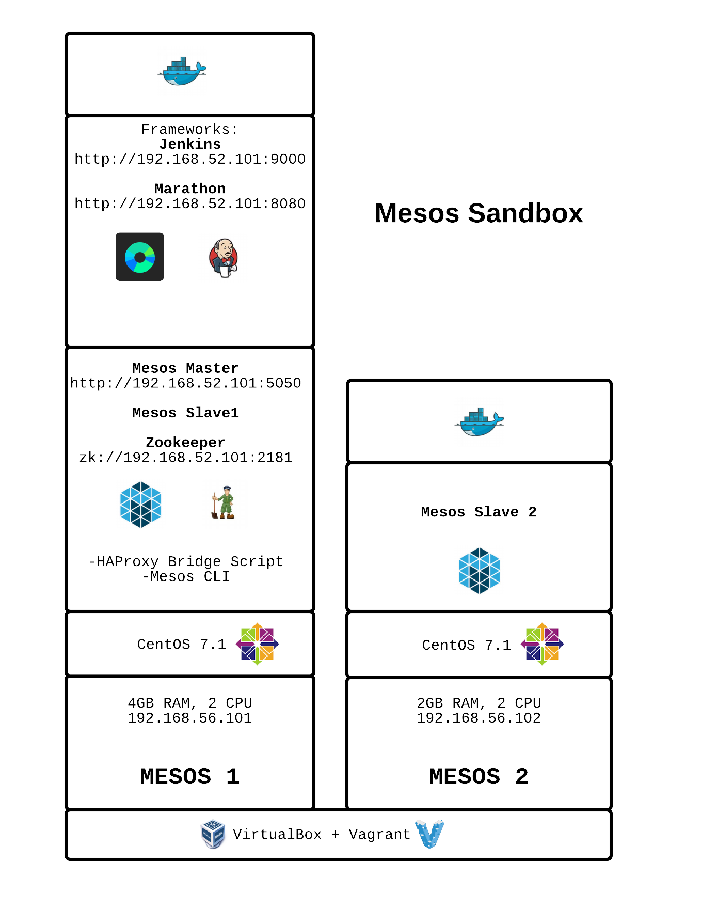

# Mesos Sandbox

## Purpose
Supply a Mesos sandbox with some frameworks enabled. Currently Marathon and Jenkins are working.

NOTE: Requires Git, Vagrant and VirtualBox to run. Scripts will most likey only work on LINUX or MAC. NOT tested on Windows.

ANOTHER NOTE: This is going to be resource intensive on your computer. May consider killing some applications and/or rebooting to start fresh. May want to update your hosts files to reflect the VMs.

Vagrant - https://www.vagrantup.com/downloads.html

VirtualBox - https://www.virtualbox.org/wiki/Downloads



## About the Environment

This sandbox will install a 2 node Mesos Cluster (1 Master and 2 slaves). The first node, Mesos1, is a bit beefier and handles zookeeper and the frameworks. The second node, Mesos2, is currently being used as strictly a slave node. Will discuss a bit about each frameworks along with some links and tutorials below.

Mesos1 Node will also include the haproxy bridging script for scaling. It will also contain the Mesos CLI project.


## To Get Started

Clone the repo and run build.sh. Will most likely take some time to complete.

```bash
git clone git@github.com:geekbass/mesos-sandbox.git
./build.sh
```

If something goes wrong or you would like to start over, destroy all things and start over!

```bash
./destroy.sh
./build.sh
```

You may use vagrant to ssh into nodes. Run below command in the directory where each Vagrantfile lives.

```bash
vagrant ssh
```

You may want to add entries into your hosts files so you can read URLs with simple names. If not here is a list of URLs:

Mesos Master: http://192.168.56.101:5050

Jenkins: http://192.168.56.101:9000

Marathon: http://192.168.56.101:8080


## Some Tutorials


## Useful Links 
